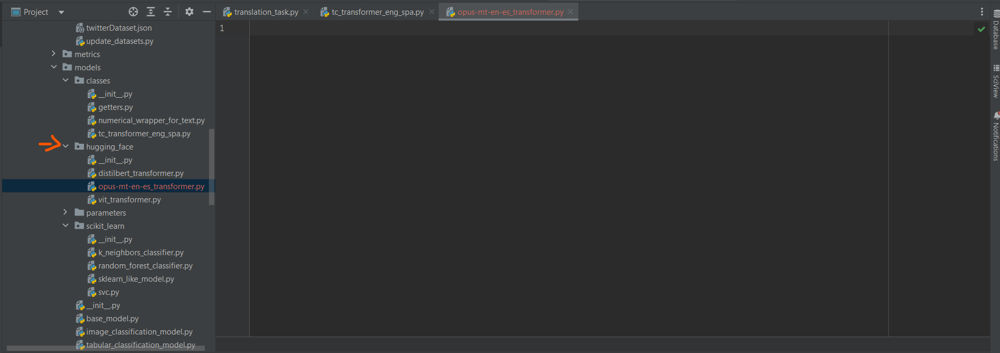
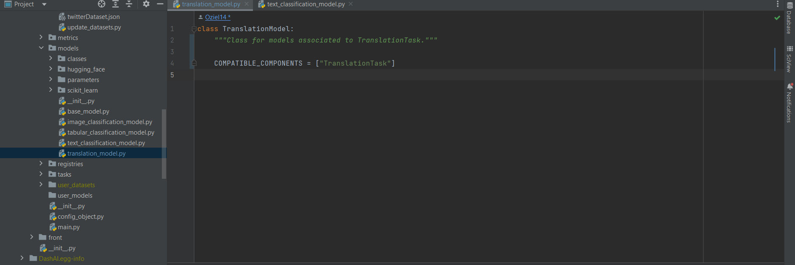
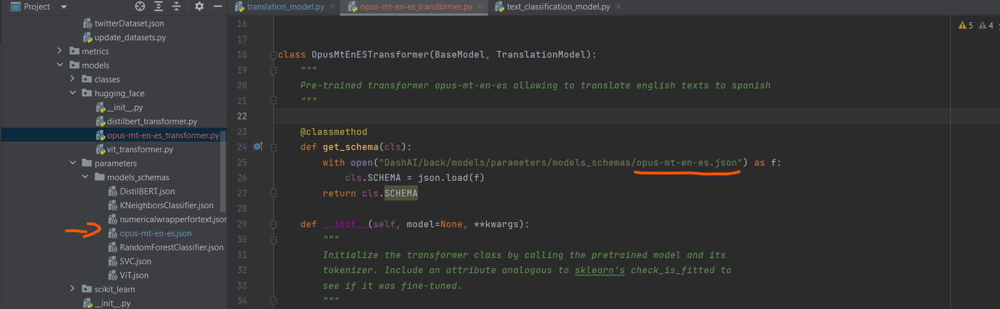

.. _user_guide:

User Guide
==========

Adding models
-------------

The following is a step-by-step guide on how to implement a new model in DashAI, specifically the Helsinki-NLP/opus-mt-en-en-es model. It is important to consider that we are working on the staging version of June 11, 2023.

Step 1: Create the model class
~~~~~~~~~~~~~~~~~~~~~~~~~~~~~~

The first part is to create the class of the model inside the corresponding folder, as in this case it is a transformer we will use the hugging_face folder.

Step 2: Verify/Create class of models associated with task
~~~~~~~~~~~~~~~~~~~~~~~~~~~~~~~~~~~~~~~~~~~~~~~~~~~~~~~~~~

Verify or create in case there is no class in the models folder that will be used to associate models to a particular task. Then, as shown in the image, the TranslationModel class will be created and in COMPATIBLE_COMPONENTS it will be specified to which task it belongs. In this way all the models compatible with the Translation task must inherit from this class.

Step 3: Create the schema file
~~~~~~~~~~~~~~~~~~~~~~~~~~~~~~

Inside the parameters folder is the folder models_schemas which contains all the parameter schemas. The JSON that will work as a schema for the model must be created and incorporated in the get_schema method of the model class.

Step 4: Define the methods
~~~~~~~~~~~~~~~~~~~~~~~~~~

It is then important to define the following methods with the following inputs:

1. Fit: method to train the model, receives a DashAIDataset.
2. Predict: method to predict with the model already trained, receives a DashAIDataset.
3. Save: method to save the model, it receives a string that represents the path where the model will be saved.
4. Load: method to load the model, it receives a string that represents where the model is saved.

Extra methods can be added depending if the model needs it or not, as well as some extra attributes of the model, as it happens in the case of transformers that need to ask for more information.

Step 5: Define the tests
~~~~~~~~~~~~~~~~~~~~~~~~

Finally, several tests must be defined to corroborate the correct functioning of the model, for this it is always necessary to load in DashAIDataset format some dataset that is useful for the model. The ideal is to ensure that the 4 methods discussed in step 4 work successfully, in addition to the creation of the schema of step 3.
